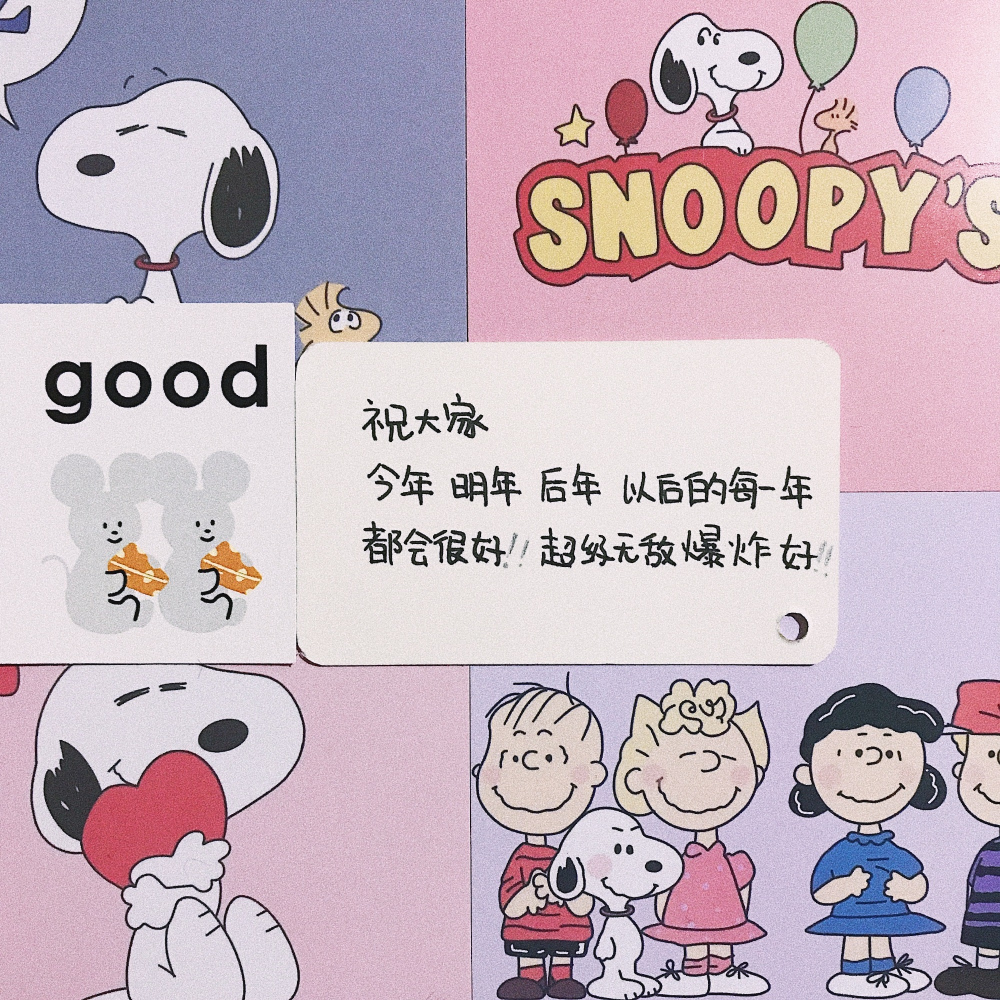

# Side Window Filter on PyTorch
The PyTorch implementation for [Side Window Filter](https://arxiv.org/abs/1905.07177) by sharing convolution filter kernel parameters.

At the same time, We also designed a **[Side Window Convolution](SideWindowConv.py)** that can be used for back propagation. 
Unfortunately, Our experiments have found that this Side Window Convolution is not as good as the original convolution.

## Demo
##### Original image

##### Image after 20 iterations with 3x3 Gaussian filtering

##### Image after 5 iterations with 5x5 Box filtering

 
